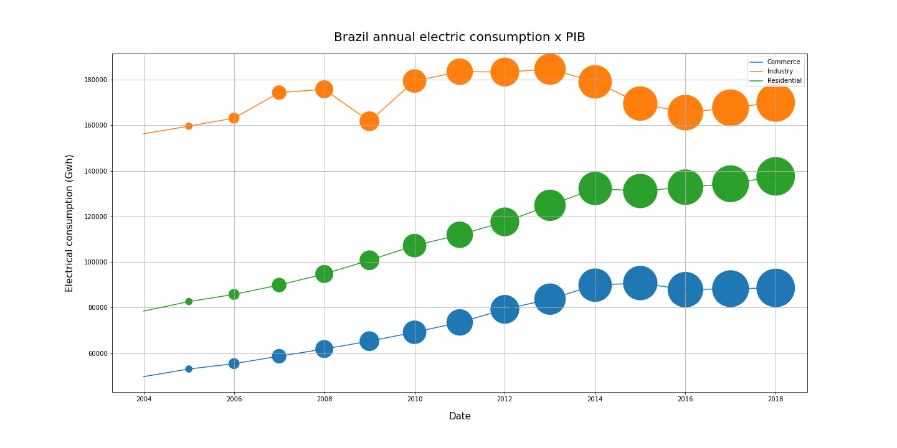
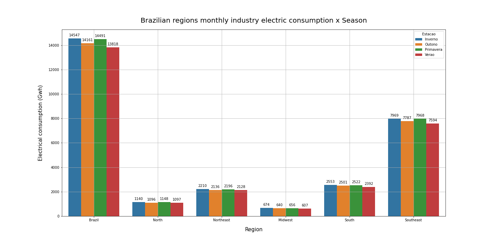

# 4Intelligence Test Case

 

# About the Case

This is a test case for the 4Intelligence company.

4intelligence develops B2B competitive intelligence platforms to support strategic and tactical decision making. It uses technology to make it simple to use statistical/econometric models and complex mathematical algorithms. In addition, they also offer a rich database, which supports all modeling processes in an integrated way.

The informations and questions of this test case can be found here: [4intelligence informations](https://github.com/pedrofratucci/4Intelligence_Test_Case/blob/main/notebooks/4Intelligence_case_PH.ipynb)

For more about the decisions made and how it was done: [4intelligence notebook](https://github.com/pedrofratucci/4Intelligence_Test_Case/blob/main/test_case_informations.pdf)

# Question 1: Perform a descriptive analysis over the dataset informations

For this question I followed a hypothesis creation method to get some insights.

I mapped the original dataset columns/variables and some others that were imported and created a Mind Map to help me with the hypothesis creation:

 

## Hypothesis 1: Brazil and regions electrical consumption, be it a Commerce, Industry or Residential consumption increases over the years

**FALSE**

 

- The Brazil commerce, industry and residential electric consumption doesn't always increase over the years, something already expected.
- The Brazilian regions commerce's electric consumptions have the same behavior over the years, keeping their values proportion.
- The Brazilian regions industry electric consumptions have the same behavior over the years, keeping their values proportion.
- The Brazilian regions residential electric consumptions have the same behavior over the years, keeping their values proportion.
- The Southeast and South regions electrical consumptions, be it commerce, industry or residential, prevails over the others Brazilian regions. That can be explained with these regions being the most industrialized regions and having the most resident population.
- Between 2019 and 2020 there is a abrupt commerce's electric consumption reduction in Brazil. This period behavior matches with the COVID-19 pandemic first wave over Brazil economy, increasing the unemployment rate, reducing the population purchasing power and consequently reducing the commerce's electric consumption.
- Between 2008 and 2009 years there is a clearly a industry electric consumption reduction in Brazil. This recession period matches with the 2008 world financial crises, the most serious financial crisis since the Great Depression. Then in 2009 to 2010 the economy starts to recover.
- Between 2013 and 2016 there is a industry electric consumption reduction in Brazil. This period behavior matches with the 2014 World Cup in Brazil spendings and the Lava Jato operation's apex, a investigations of billions in deviated resources from Brazilian state companies.
- There is a "exponential" residential electric consumption increase in Brazil between 2014 and 2020. By searching for the  Brazilian electrical tariff flag's historic in this period, this period was dominated by the green flag, the most favorable flag for  power generation.

## Hypothesis 2: Brazil and regions annual electrical consumption, be it a Commerce, Industry or Residential consumption increases with the PIB increase

**TRUE**

 

- The PIB, represented by the bubbles size, increases year over year, which is great for our nation. 
- There is a pattern, if we close our eyes for the crises events mentioned in the Hypothesis 1 above, which we can say that the Industry, Commerce and Residential electric consumptions increases with the PIB increase.

This correlation is probably caused due to the Brazil industrial and economic power increasing year by year. Then, we can spend more in industrial production, warm up our commerce due to the purchasing power increasing and spend more in residential comfort.

## Hypothesis 3: Brazilian regions monthly residential electric consumption per its resident population, are higher in summer season then in the others

**FALSE**

 

- Brazil monthly residential electric consumption per capita in summer is the highest one.
- The regions residential's electric consumption distribution per capita over the seasons are not so discrepant from each other. That is probably due to some kind of compensation. For example, in summer people tends spend a lot of electric power with air conditioner, and in the winter this consumption is compensated with some kind of room heater and electric shower. 
- Something that is interesting is that the North region is the one with the most discrepant residential's electric consumption values distribution over the seasons, but its the second region with the lowest maximum temperature range over the dataset timeline (as we saw in section 2.6), due to be the most equatorial region.

## Hypothesis 4: Brazilian regions monthly residential electric consumption per its resident population, are higher in summer season then in the others

**FALSE**

 

- The regions monthly industry electric consumption over the weather seasons maintains the same distribution pattern.
- Despite of our hypothesis affirmation, winter seems to be the season that the industry section consume more electrical power, winning by a slightly difference from spring season. Our hypothesis was based that in summer the industry employees go on vacation and the industry rush on spring season to compensate this.
- Overall, the industry sector seems to maintain the same production / electrical consumption pattern over the year. I would be interesting understand more about it, because there are some industries that have a seasonal production.

## Hypothesis 5: Brazilian annual commerce's electric consumption increases with the PIB per capita increase

**TRUE**

 

- The Brazil commerce electric consumption over the years X PIB per capita have the same behavior as compare to the PIB, as we saw in section 4.1.2. 

We know, Brazil is one of the top countries when we rank the countries with the worsts distribution of income. So even if Brazil's PIB per capita increases over the years, it doesn't mean that this income increase is well distributed to the population.

Based on this, checking if the commerce electric consumption increases with the PIB per capita, its an indicator that probably the income distribution is getting better, because the commerce is warmed by the population's purchase power.

## Hypothesis 6: Brazil and regions monthly electrical consumption, be it a Commerce, Industry or Residential consumption decreases on months of daylight saving time than the others

**FALSE**

 

- There isn't a big difference between the monthly electrical consumption between months with daylight saving time in the residential sector. In factor, almost all regions, excluding Southeast, have a slights residential electric consumption higher when is not a DST period. 
- The regions industry sector follows the same pattern as the residential sector, without a big difference between the monthly electrical consumption between months with daylight saving time in the residential sector. But, in the big picture, Brazil presents a 194 Gwh monthly industry electric consumption reduction when in DST 

Doing a quick research, assuming that 1 Mwh costs R\$ 350 for the industry sector in Brazil, the 194 Ghw reduction indicates a 
R\\$ 68.000.000,00 cost reduction. 

- For the commerce sector, the Brazil and Southeast region total electrical consumption are higher when in DST.I couldn't find a possible explanation for this, so far.

This **perhaps** could be explained by: A longer daylight period makes people stay on the street longer, more propense to go to the commerce, so the commerce have to stay opened a longer period, then consuming more electricity.

**DISCLAIMER**: As we said in section 3.1, DST were not applied to the North and Northeast regions in this dataset timeline, that's why they were not analyzed.

## Hypothesis 7: Brazil electrical consumption mean value, be it a Commerce, Industry or Residential consumption increases with the working population increase

**TRUE**

 

- This hypothesis is pretty clear, almost trivial so to speak, that for all sectors the working population increase will automatically increase the sector electrical consumption. 

There are a reduction of the industry electrical consumption for working populations range between 90 and 95 millions, but this is probably due to the crises period that we analyzed in section 4.1.1.

**The working population shows as pretty good feature to be considered for the ML model, which we will try to predict the Southeast industry electric consumption.**

## Hypothesis 8: Brazil residential electrical consumption mean value increases with the real income increase

**TRUE**

 

- This hypothesis is pretty clear, almost trivial so to speak again, that for the residential sector the real income increase will automatically increase the residential electric consumption. 

This can be explained by the families purchasing power increase, by the real income increase (which is apply by person). So, with this real income increase the families with probably spend more in home comfort and some of these home upgrades includes buying more home appliances, for example.

# Question 2: Create a machine learning model to predict the Southeast industry electric consumption for the next 24 months

In process...

# Question 3: Choose the top 5 best machine learning models tested and explain the reason for considering them as candidates

In process...

# Question 4: What can we conclude from Questions 1, 2 and 3

In process...

# References

- https://www.linkedin.com/company/4intelligence-ai/about/

- https://sidra.ibge.gov.br/tabela/6579

- https://sidra.ibge.gov.br/Tabela/6784

- https://pt.wikipedia.org/wiki/Lista_de_per%C3%ADodos_em_que_vigorou_o_hor%C3%A1rio_de_ver%C3%A3o_no_Brasil
