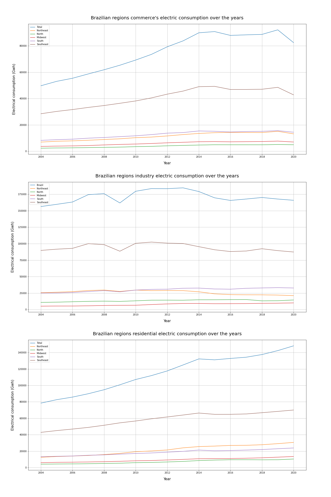

# 4Intelligence Test Case

# ABOUT THE CASE

The informations and questions of this test case can be found here: [4intelligence informations](https://github.com/pedrofratucci/4Intelligence_Test_Case/blob/main/notebooks/4Intelligence_case_PH.ipynb)

For more about the decisions made and how it was done: [4intelligence notebook](https://github.com/pedrofratucci/4Intelligence_Test_Case/blob/main/test_case_informations.pdf)

# QUESTION 1: Perform a descriptive analisys over the dataset informations

For this question I followed a hypothesis creation method to get some insights.

I mapped the original dataset columns/variables and some others that were imported and created a Mind Map to help me with the hypothesis creation:

 

## Hypothesis 1: Brazil and regions electrical consumption, be it a Commerce, Industry or Residential consumption increases over the years

**FALSE**

 

- The Brazil commerce, industry and residential electric consumption doesn't always increase over the years, something already expected.
 

- The Brazilian regions commerce's electric consumptions have the same behavior over the years, keeping their values proportion.
 

- The Brazilian regions industry electric consumptions have the same behavior over the years, keeping their values proportion.
 

- The Brazilian regions residential electric consumptions have the same behavior over the years, keeping their values proportion.
- The Southeast and South regions electrical consumptions, be it commerce, industry or residential, prevails over the others Brazilian regions. That can be explained with these regions being the most industrialized regions and having the most resident population.
- Between 2019 and 2020 there is a abrupt commerce's electric consumption reduction in Brazil. This period behavior matches with the COVID-19 pandemic first wave over Brazil economy, increasing the unemployment rate, reducing the population purchasing power and consequently reducing the commerce's electric consumption.
- Between 2008 and 2009 years there is a clearly a industry electric consumption reduction in Brazil. This recession period matches with the 2008 world financial crises, the most serious financial crisis since the Great Depression. Then in 2009 to 2010 the economy starts to recover.
- Between 2013 and 2016 there is a industry electric consumption reduction in Brazil. This period behavior matches with the 2014 World Cup in Brazil spendings and the Lava Jato operation's apex, a investigations of billions in deviated resources from Brazilian state companies.
- There is a "exponential" residential electric consumption increase in Brazil between 2014 and 2020. By searching for the  Brazilian electrical tariff flag's historic in this period, this period was dominated by the green flag, the most favorable flag for  power generation.

